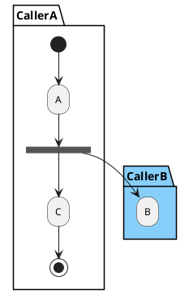
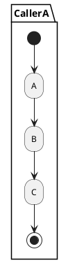
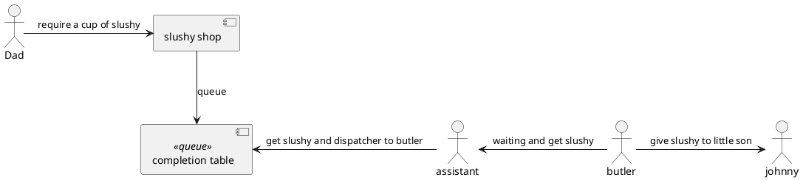
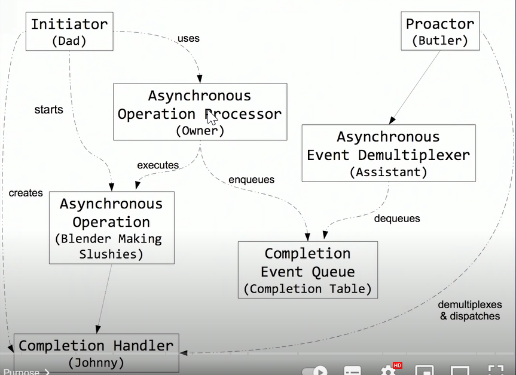

# asio
asynchronous I/O Library

## asynchronous operation
B 不在当前时刻执行，但可以是自己的线程被执行

## functionality
- 提供丰富的组件，比如timer，signal, buffer，socket, SSL等
- 同时支持同步与异步接口

## proactor pattern
- 关于proactor pattern，一个形象的故事，来帮忙了解proactor模式有哪些role，及负责的内容
https://www.youtube.com/watch?v=rwOv_tw2eA4
Dad带一家子买冰沙的故事,
1. 老爸自己带的杯子, 给小儿子（johnny）点冰沙
2. 冰沙店做好冰沙后，把冰沙放到桌子上
3. 助手从冰沙桌上取冰沙，然后，交给大儿子(butler)
4. 大儿子在冰沙店边，等冰沙，然后，给小儿子，每次只能拿一杯冰沙

- what's from story
1. APP(Dad) 负责创建request, memory(杯子)，Handle thread(`io_context`，大儿子), 及completion handler(小儿子)
2. 通常几个`io_context`就能处理所有的completions
3. Butler deliver the result to completion handler
4. 不是所有的completion handler 能够同时处理多个结果, 需要处理data race的情况

- 对应关系

## io_context
- Feature
1. 共享io_context是线程安全的，除了`restart`及`notify_fork()`操作
2. 所有的Handler(callback), 在由调用`run`, `run_one(), run_for(), run_until(), poll() or poll_one()`的线程执行
3. 所有CallBacks执行完后，`run`返回。所以，为了避免io_context退出，APP通常会在callback中，注册下一个callback，以实现loop处理任务。
4. Application 退出时，要显式的调用`stop`，来结束`io.run`

https://www.boost.org/doc/libs/1_82_0/doc/html/boost_asio/reference/io_context.html

## 多线程与io_context
1. 多个线程调用`io_context.run`, 当completions 发生时，completions 机会均等的由多个线程执行

https://nanxiao.gitbooks.io/boost-asio-network-programming-little-book/content/posts/connect-server.html
https://www.boost.org/doc/libs/1_67_0/doc/html/boost_asio/overview.html

## two kinds of component
`io_context`:IO framework，封装与操作系统的交互
`io_object`:业务组件，将具体的业务请求，发给`io_context`，比如socket.connect
事件到来后,如有connect上来，则通知`io_context`，并执行其等待的业务

## asio::strand
通过`strand`封装callback handle，可以保证，在多个线程中，并行执行的callback handle时, 能够依次执行callback handle，从而保证即使存在shared data时也不会出现竞争。
即`strand`保证了callback handle不并发执行，因此，shared data数据不会出现竞争，而不需要加锁进行保护。
- 为什么不用mutex，而使用strand? 性能上有优势吗？
https://www.bogotobogo.com/cplusplus/Boost/boost_AsynchIO_asio_tcpip_socket_server_client_timer_bind_handler_multithreading_synchronizing_C.php

## handler lifecycle 设计
shared_from_this
