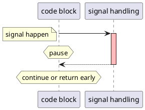

# signal handler
A user defined callback to executing when a specific signal happened.

## what should and should not in a signal handler
A signal handler can be interrupted by itself or other signal, so the contained functions must be reentrant, and can not be no reentrant implicitly or explicitly. like `lock`, `pritf` and `malloc`, those can't be called in a signal handler.

## signal-safe function(async-signal-safe)
a signal-safe function is either reentrant or atomic, i.e. can't interrupt by signals.

### a set of async-signal-safe functions

## signal side effect
Signal makes any process be concurrent. As whenever signal happens, a process has to switch to execute the signal handling immediately. After executing signal handling, then a process exit directly or return back to interruption point. when a process executing is interrupt by signal, it can continue executing sometimes, but return early with `EINTR` at other times, such as `select`, `poll`.
If data accessed by both signal handling and the process, then data race will happen.

### signal executing
a concurrent process


## make code-block atomic
As code executing can be interrupted by signal, if you mask ignoring the signal before enter the code block, then unmask before leaving, this code block becomes atomic.
```cpp
{

}
```

## reference
[what-should-you-not-do-in-a-signal-handler](https://technicqa.com/what-should-you-not-do-in-a-signal-handler/#:~:text=Signals%20are%20asynchronous%20by%20their%20nature.%20Another%20signal,any%20non-reentrant%20code%20%E2%80%94%20neither%20explicitly%20nor%20implicitly.)
[signal-safe functions](https://man7.org/linux/man-pages/man7/signal-safety.7.html)
[深入理解计算机系统]

