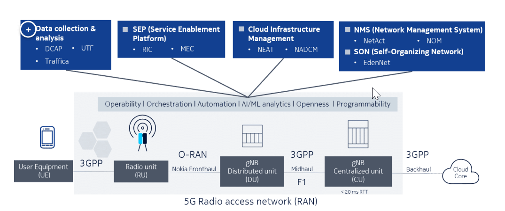
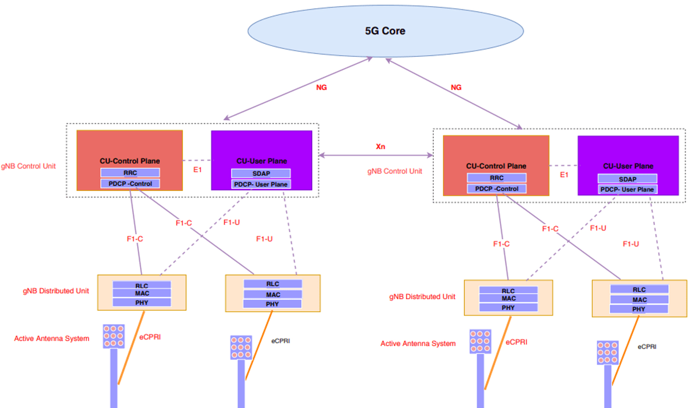
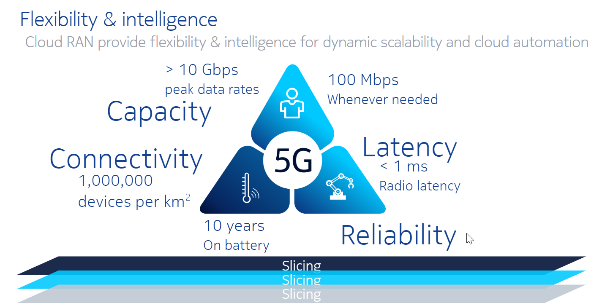
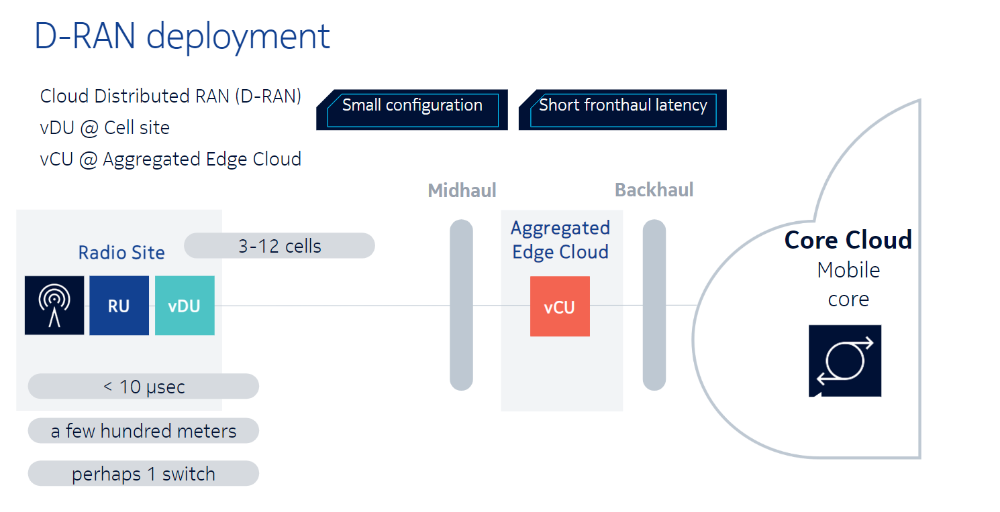
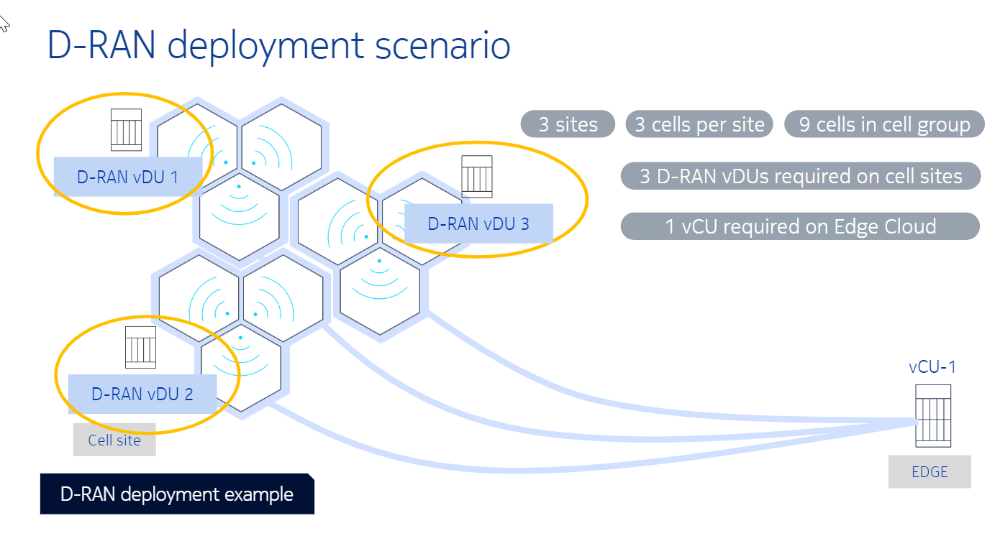

# RAN
Radio access network

- [system view](#system-view)
  - [connection](#connection)
- [5G requirement](#5g-requirement)
- [D-RAN deployment](#d-ran-deployment)

## system view

RAN由RU，DU及CU构成。
- UE
user equipment(UE): 用户设备，如手机

- RU
Radio unit(RU)：[todo]

- DU and CU
gNB Distributed unit(DU): 靠近RU的方式进行部署的gNB，负责处理，对实时要求高的业务，如UPlane，用户面消息。
gNB Centralized unit(CU): 原理RU的方式进行部署的gNB，负责处理对实时性要求不高的业务，如CPlane，控制面消息。
每个gNB负责处理通信业务（NetworkFunction）
详见：[vDU](./vDU.md)

- core network
Core network: 即以太网

### connection
RAN内部各Entity，RAN与core network之间，通过协议接口相连。
RU与DU之间，通过eCPRI协议接口相连
DU与CU之间，通过F1协议接口
CU之间，通过Xn协议接口相连
CU与core network，通过NG协议接口相连

## 5G requirement
- connections
  每平方公里，1,000,000个UE
- 延时
  端到端的延时小于1ms
- 带宽
  100Mbps, 同时，最大峰值大于10Gbps

## D-RAN deployment

- Multi DU connect to one CU

