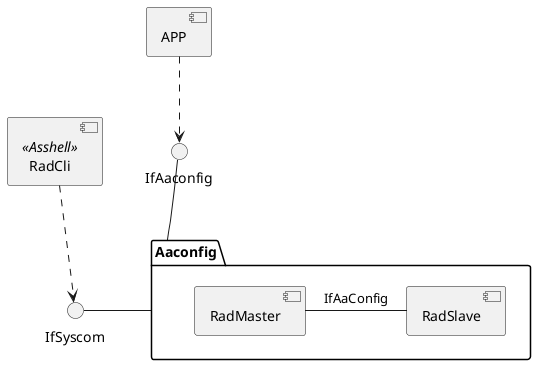
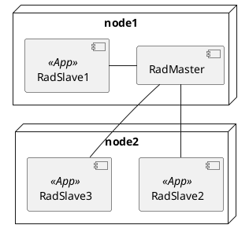
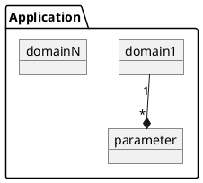
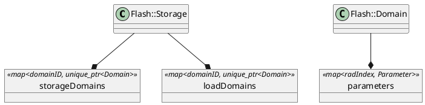

# AaConfig
AaConfig 用来配置Application的runtime参数，同时，支持集中化配置，即同时配置所有APP。其定义了三种类型参数，tag，rad，及service registry，对应着三种相似的接口。
AaConfig支持参数持久化，即存储到文件系统或数据库

- rad parameter
  rad parameter由domainID + radID组成的一个U32类型的值，即parameter = domainID << 16 + radID
  如domainID = 1，radID = 2，对应的parameter为 0x10002。
  设置参数0x10002等于1，即0x10002 = 1；

- SW Domain
  SW Domain 按模块（component）进行区分与定义，每个模块都有唯一相对应的DomainID。每个domain，可以包含多个parameters。

## component view
APP 通过IfAaConfig接口或者Syscom Message的方式，访问AaConfig



## deployment
AaConfig，由一个RadMaster及多个RadSlave组成。
每个APP都包含一个RadSlave。
一个RadSlave可包含多个SW Domain.




- 集中化设置
  因为多个APP都使用了一系列相同的模块，如都使用`syscom`,`syslog`等模块，所以，需要支持集中化设置。
  集中化设置，通过radMaster -> radSlave的方式实现

## 建立radMaster与radSlave的关系
radMaster与radSlave，通过服务发现的方式，建立关系。
通过服务发现，radSlave知道radMaster SIC address，然后，将自己注册到radMaster。这样radMaster，就能管理所有的radSlaves。

## 向RadMaster注册domain
RadSalve向RadMaster发送domain注册的消息

## set rad parameter
App通过向RadMaster发送设置rad的syscom消息，更新在RadMaster上的参数，如value，mask等。
然后，由RadMaster转发消息到RadSlave，更新在RadSlave上的参数值。

```plantuml
participant radCli
participant App
participant AaConfig
participant RadMaster
participant RadSlave
alt#Gold global setting case
    radCli -> RadMaster : send AACONFIG_RAD_SET_PARAMS_REQ_MSG
else #LightBlue slave or local setting
    radCli -> RadSalve : send AACONFIG_RAD_SET_PARAMS_REQ_MSG
end

note over RadMaster
1. set rad value to runtime or persistent storage
2. update domains
3. forward message to radSlave
end note
RadMaster -> RadSlave : forward AACONFIG_RAD_SET_PARAMS_REQ_MSG
RadSlave -> RadMaster : send response
RadMaster -> radCli : set response


App -> AaConfig : AaConfigRadSetGlobalValues
AaConfig -> RadMaster : send AACONFIG_RAD_PARAMS_EXT_SET_REQ_MSG
RadMaster -> RadSlave : forward AACONFIG_RAD_PARAMS_EXT_SET_REQ_MSG
RadMaster -> AaConfig : send response
AaConfig -> App
```

## 参数的管理与存储
`storage`管理Domains，添加，删除Domain。
`Domain`管理Parameters，添加，删除参数，修改参数值。
实现上，分成runtime与persistent两种类型，风别管理runtime::Domain与Flash::Domain两种对象。
runtime::Domain对象，管理了runtime::Parameter, Flash::Domain, 管理了Flash::Parameter。
设置persistent类型的参数时，会存储到Flash下的storeDomain，同时，写到文件“swconfig.txt”
设置oneRest类型的参数时, 会存储到Flash下的storeDomain，同时，写到文件“swconfig_oneshot.txt”


runtime::storage 与 Flash::Storage结构类似。

- reference
AaConfig API SPECIFICATION
