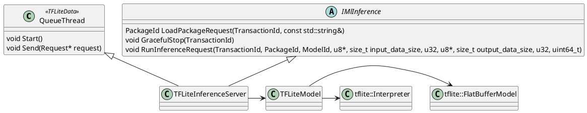
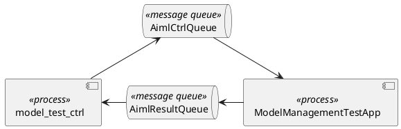

# aiml

## APP
## ClientAPI
APP request a inference through this API.

## ServerAPI
## Inference scheduler
1. 可以管理多个`Inference Server`
2. 通过`AaConfigRegisterService` API, 告诉其他server，比如`ML Management service`,自己启动了。
3. 接收从APP发送过来的Inference request

## Inference Server
Inference server in charge of executing inference. such as a Tflite inference server.

### Tflite inference server
基于tflite的inference server

## ML Management service
1. 通过`AaConfigSubscribeService` API，知道Inference Engine 的SICAD, 以实现与Inference Engine之间的通信。
2. Model management handler deals with model loading, update, and deletion requests from ML management service.

## implementation
### NrtInferenceEngine

### ModelManagementTestApp
1. receive model operation message from model_test_ctrl

### loop receive model operation message
利用`AaSysTimerCreate`API, 给自己发消息，触发receive model operation message.
通过`timer_create` POSIX API，创建一个定时器，在实现TimerCreate的功能

### TFLiteInferenceServer


### model_test_ctrl
model_test_ctrl parse model operation from cli, then send the message to Management service, and receive operation result.

```cpp
struct ControlMsg {
    Engines    engine;
    Operations operation;
    uint16_t   nid;
    modeltag_t modeltag;
    char       model_or_config_path[512];
    int        timeout;
};
```
command:
/tmp/model_test_ctrl -e inference -o load -n /tmp/aiml/mMIMO_2x128_RRS_TFLITE.tflite -m 1
`-e` : engine
`-o` : operation
`-n` : package name to be load/upgrade, save to `model_or_config_path`
`-m` : modeltag

### NrtClientTestApp

### syscom handling engine/framework

### note：
数据类型经常变，不固定，很适合使用template

## reference
[nRT_inference_engine_architecture.docx](https://nokia.sharepoint.com/:w:/r/sites/aiml-bbp/Nokia%20Controlled%20Documents/AIML-Architecture/Training%20%26%20Data%20collection%20engine%20(CB008761)/nRT_inference_engine_architecture.docx?d=we0c27d96256a4499bc727e1c15e0379f&csf=1&web=1&e=2fPuDf)
