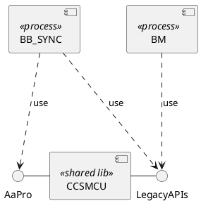
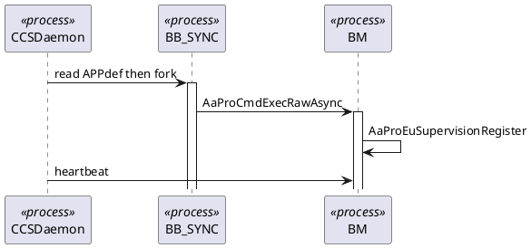
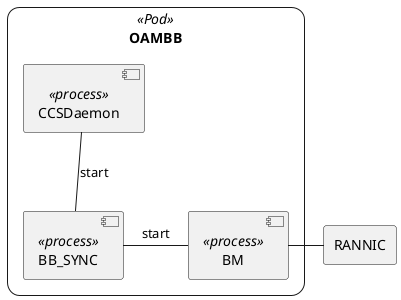

# cb010606 aapro extension

## component diagram

```plantuml
@startuml

[BB_SYNC] <<process>>
[BM] <<process>>
[CCSMCU] <<shared lib>>

BB_SYNC ...>() AaPro : use
BB_SYNC ...>() LegacyAPIs : use
AaPro - CCSMCU

BM ...>() LegacyAPIs : use
CCSMCU - LegacyAPIs
@enduml
```

## sequence diagram

```plantuml
@startuml
participant CCSDaemon <<process>>
participant BB_SYNC <<process>>
participant BM <<process>>
CCSDaemon -> BB_SYNC: read APPdef then fork
activate BB_SYNC
BB_SYNC -> BM: AaProCmdExecRawAsync
activate BM
BM -> BM : AaProEuSupervisionRegister
CCSDaemon -> BM : heartbeat
@enduml
```

## deployment diagram

```plantuml
@startuml
skinparam rectangle {
    roundCorner<<Pod>> 25
}

rectangle "OAMBB" <<Pod>> {
[BB_SYNC] <<process>>
[BM] <<process>>
[CCSDaemon] <<process>>
CCSDaemon -- BB_SYNC : start
BB_SYNC -right-BM : start
}
rectangle RANNIC
[BM] -right- RANNIC
@enduml

```