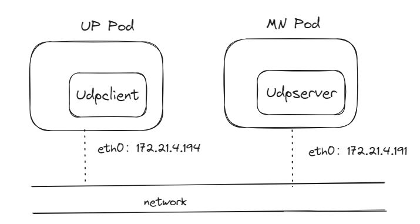

# UDP support both IPv6 and IPv4
Aasyslog support forwarding log to UDP with both IPv6 and IPv4

## network deployment
```bash
[cranuser8@master2 up]$ kubectl get pod -o wide
NAME                                          READY   STATUS    RESTARTS   AGE     IP             NODE                                              NOMINATED NODE   READINESS GATES
ccsrt-mn-0                                    2/2     Running   0          8m38s   172.21.4.191   worker1.estcoe009-oe19-ocp.dyn.tc.nsn-rdnet.net   <none>           <none>
ccsrt-up-0                                    1/1     Running   0          2m26s   172.21.4.194   worker1.estcoe009-oe19-ocp.dyn.tc.nsn-rdnet.net   <none>           <none>
```

- note:
  eth0 on UP Pod and MN Pod are virtual.

## route In IPv4 and IPv6
- IPv4 environment
Pod MN
```bash
bash-5.2$ ip route
default via 172.21.4.1 dev eth0
172.21.4.0/23 dev eth0 proto kernel scope link src 172.21.4.191
bash-5.2$ ip -6 route
fe80::/64 dev eth0 proto kernel metric 256 pref medium
fe80::/64 dev fhm proto kernel metric 256 pref medium
fe80::/64 dev oam proto kernel metric 256 pref medium
fe80::/64 dev trace proto kernel metric 256 pref medium
```
Pod UP
```bash
bash-5.2$ ip route
default via 172.21.4.1 dev eth0
172.21.4.0/23 dev eth0 proto kernel scope link src 172.21.4.194
bash-5.2$ ip -6 route
fe80::/64 dev eth0 proto kernel metric 256 pref medium
fe80::/64 dev trsfptun proto kernel metric 256 pref medium
fe80::/64 dev trsfptunout proto kernel metric 256 pref medium
fe80::/64 dev f1 proto kernel metric 256 pref medium
fe80::/64 dev f1out proto kernel metric 256 pref medium
```
- note:
  在IPv4的环境，不能与IPv4 mapped IPv6地址::ffff:AC15:04BF(172.21.4.191)server，进行通信
- IPv6 environment

## IP stack and socket
- single stack
  1. IPv4 server只能支持IPv4 client
  2. IPv6 server只能支持IPv6 client
- dual-stacks
   1. IPv4 server只能支持IPv4 client
   2. IPv6 server可以同时支持IPv4 或者IPv6的client。内核协议栈，自动转换IP地址（IPv4 address to IPv4-mapped IPv6 address），APP不感知。
https://zaf1ro.github.io/p/b4e.html
http://long.ccaba.upc.edu/long/045Guidelines/eva/ipv6.html

## IP Protocol agnostic program
通过`getaddrinfo`, 将IP地址与端口，转成不依赖IPv4与IPv6地址结构，然后，使用该地址结构，调用`bind`或`connect`，以实现不依赖IPv4及IPv6的APP。比如：
IP dependence code
```cpp
// for IPv4
struct sockaddr_in localAddress;
localAddress.sin_family = AF_INET;
localAddress.sin_addr.s_addr = INADDR_ANY;
localAddress.sin_port = htons(static_cast<uint16_t>(port));
// for IPv6
struct sockaddr_in6 localAddress;
localAddress.sin6_family = AF_INET6;
localAddress.sin6_addr = in6addr_any;
localAddress.sin6_port = htons(static_cast<uint16_t>(port));
bind(sock, (struct sockaddr*)&localAddress, sizeof(localAddress))
```
详见：https://man7.org/linux/man-pages/man3/getaddrinfo.3.html
