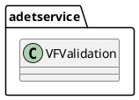
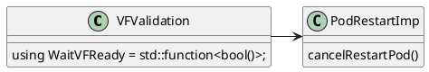
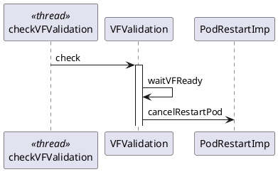
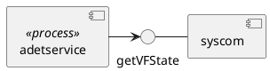

# cb010643 VF validation

## design
### adetservice

class VFValidation is in charge of waiting VF ready, then call reset timer.

using std::function to design `strategy` patten, as the strategy of WaitVFReady maybe change later, such as
alternative1: looping check VF ready flag from syscom, which is current solution.
alternative2: receive sctp_up event from kernel.
other alternatives.
```cpp
/**
* a block call, If vf is ready, then WaitVFReady return true
* if process termination, then return false
*/
using WaitVFReady = std::function<bool()>;
```


### syscom

syscom provide an interface of `getVFState`, if VF state is ready then return true, else return false.
getVFState use to read VF ready flag from shared memory, which will be set by syscomd.
