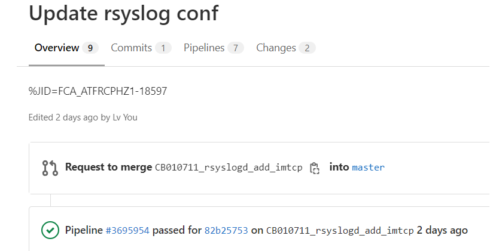
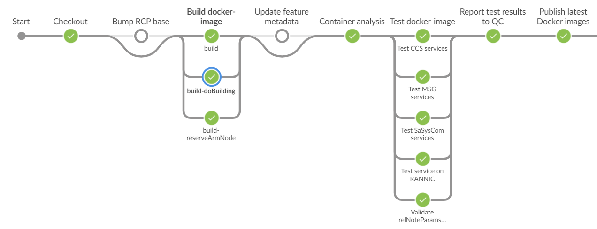

# l1commproxy delivery
`l1commproxy` delivery 就是`l1commproxy` image的修改，提交，测试，发布(打tag)的过程。每个change，对应一个MR的提交，然后，gitlab 会自动地通过`Jenkins`，进行l1commproxy image的测试流程，即pipeLine。

<figure>
  
  <figcaption>Figure1: MR trigger pipeline job</figcaption>
</figure>

测试流程（Pipeline），一般包含checkout repo，编Images，测试Image及提交Image
1. checkout repo
  将`l1commproxy-container` repo，下载到测试环境。`l1commproxy-container`包含Dockerfile，配置文件（RCP base version，Pod的Deployment version），Jenkinsfile等资源。
1. 编Images
  根据`Dockerfile`及RCP base version，编相应的Image。Base version中，记录着每个模块的版本信息。
1. 测试Image
  1. 网络及repo准备
   - 创建network interface, 如cp, bip, f1,l1cpTest等
   - checkout Helm repo，根据配置文件（`config`）记录的版本，下载对应的Helm repo。
  2. 部署Pod（deployment Pods）
    - Install Pod，将上一步编出的Images，作为入参，传到helm install命令中，部署Pod
  3. 测试Image
    运行robot Pod中的test cases, 进行测试。如：/opt/nokia/bin/start_robot.sh
  4. 收集测试结果
2. 提交Image
  将通过测试的Image，push到Image的仓库。这样新的Image，就可以被其他人使用了。如：

- Pipeline
  Pipeline就是把上述的测试流程串起来的一个概念
<figure>
  
  <figcaption>Figure1: pipeline view</figcaption>
</figure>

## l1commproxy-container repo
`l1commproxy-container`包含如何编Image及如何测试Image的配置文件及对应执行脚本，一些Helm工程。
- `Dockerfile`文件
  `Dockerfile`文件指导如何编Image，如
```dockerfile
  FROM ${BASE_IMAGE}:${BASE_IMAGE_VER}
  RUN microdnf install \
              adetservice
  ENTRYPOINT ["/usr/bin/ministarter"]
```
- `Jenkinsfile`文件
  `Jenkinsfile`文件指导如何测试，即如何创建Pipeline，如：
```jenkinsfile
Map containers = [
    DockerImage: [
    name: 'l1commproxy/l1commproxy',
    buildName: 'build',
    testNames: [
        'Test CCS services'
    ],
    published: true,
    type: 'runtime'
    ]
]
List builds = [
    [
        name: 'build',
        agent: 'docker_helmci',
        command: 'ci/docker-build',
        s3Artifacts: '*.log',
        timeout: 30
    ]
]
List tests = [
[
    name: 'Test CCS services',
    runOnHW: true,
    tersyParams: tersyParamsOCP,
    helmName: 'ahm',
    agent: 'single-node-container-k8s-dpdk',
    prepareCommand: 'ci/prepare',
    command: 'ci/pod-test-ccs',
    logsCommand: 'ci/pod-logs CCS',
    cleanCommand: 'ci/pod-clean',
    addSkipParam: true,
    timeout: '30'
]]
...
```
`List builds`: 指导怎么编译Image
`List tests`: 指导怎么进行test

- `config`文件
  记录Base Image，Helm工程版本等，如：
```
BASE_IMAGE_VER=RCP_23.52.3001
#helm-dependency: up
UP_HELM_CHART_TAG=10.5.0
...
```
- 脚本
```bash
$ ls -l ci
...
-rw-r--r-- 1 yanzhu root   339 Apr 19  2023 clone-container-scriptssh
-rwxr-xr-x 1 yanzhu root 31148 Dec 26 17:11 common
-rwxr-xr-x 1 yanzhu root  4688 Dec 26 17:11 docker-build
-rwxr-xr-x 1 yanzhu root  1091 Dec 26 17:11 docker-build-ssh
```
https://gitlabe2.ext.net.nokia.com/rcp/containers/l1commproxy

## changes
- 代码改动，最后，通过改变`config`中的`BASE_IMAGE_VER`的改动，来触发pipeline
- helm改动，通过`config`中的`UP_HELM_CHART_TAG`的改动，来触发pipeline
