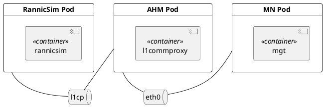

# l1commproxy syscom setup
`l1commproxy` container syscom 的建立，主要由3个进程完成，syscomrouteproxy，syscomRannicProvider,syscomgw(syscomdaemon)。

- [syscom 通信建立](#syscom-通信建立)
- [Pod部署图](#pod部署图)
- [syscom路由信息](#syscom路由信息)

## syscom 通信建立
`syscomrouteproxy`通过解析`syscomroute`的配置文件，获取需要与哪些对端（syscom peers）建立route，同时，将自己的Type，NodeID，IP地址，Port等信息，以服务`SysComEndPoint`的方式，通过service provider的方式，发布出去。另外，通过service discover机制，订阅`SysComEndPoint`服务，来获取对端的NodeID，IP地址，Port。将自己与对端的信息，通过syscom消息，发送给syscomgw，以建立起自己与对端的syscom route。完成syscom route建立后，双方就能进行syscom的通信。
- 每个container，都会通过helm，注入一个syscom_endpoint_type的环境变量。根据这个变量，脚本syscom_profile_prase.sh，就能根据配置文件，解析出own_node id，port等信息。
- 各Pod syscom route信息，通过服务发现的方式，实现启动顺序的解耦。RCP对应的实现是lwsd，同时，当Pod退出（服务下线）时，可以通知其他Pod，更新路由信息。
- 其他Pod中container的syscom路由，都是通过上述过程建立。

`syscomRannicProvider`, 接收l1的Node Allocate request, 然后，把RANNIC的Node ID信息，通过syscom消息，告诉RANNIC。这样RANNIC，可以通过这个Node ID，经由l1commproxy，发送消息给其他Pod。
通过`syscomRannicProvider`，把`l1commproxy`的IP及RANNIC的NID，发布出去。这样其他Pod，给RANNIC发消息，就会先发到`l1commproxy`，经由`l1commproxy`，转发给RANNIC。

## Pod部署图

- l1cp link的建立，通过`ip`命令完成。通过脚本，https://gitlabe2.ext.net.nokia.com/rcp/internal-helm/rcp-pod-ahm/-/blob/master/templates/l1cpnetworkscript-configmap.yaml，完成。

## syscom路由信息
- l1commproxy container
```bash
ID   FD   LSIC        RSIC        LIP             LPORT  RIP             RPORT   PROTOCOL  RETAIN  MSGID
---  ---  ----------  ----------  --------------  -----  --------------  -----   --------  ------  ------
1    20   0xE500FFFF  0xE501FFFF  192.168.253.16  49157  192.168.253.20  49157   SCTP      YES     0x0000
2    21   0xE500FFFF  0xE010FFFF  172.21.5.170    49157  172.21.5.164    49155   SCTP      YES     0x0001
```
- mgt container
```bash
ID   FD   LSIC        RSIC        LIP           LPORT  RIP           RPORT   PROTOCOL  RETAIN  MSGID
---  ---  ----------  ----------  ------------  -----  ------------  -----   --------  ------  ------
1    50   0xE010FFFF  0xE501FFFF  172.21.5.164  49155  172.21.5.170  49157   SCTP      YES     0x0001
2    50   0xE010FFFF  0xE503FFFF  172.21.5.164  49155  172.21.9.47   49157   SCTP      YES     0x0001
```
  - note
    1. to RANNIC node ID but with l1commproxy IP
- rannic sim
```bash
ID   FD   LSIC        RSIC        LIP             LPORT  RIP             RPORT   PROTOCOL  RETAIN  MSGID
---  ---  ----------  ----------  --------------  -----  --------------  -----   --------  ------  ------
1    20   0xFFFFFFFF  0xFFFFFFFF  192.168.253.20  49157  192.168.253.16  49157   SCTP      YES     0x0001
```

1. 服务下线时，能够检查到，说明lwsd与服务之间，存在心跳。
2. 多AHM时，怎么共用l1cp？
   1. deployment的配置，使用l1cptest与l1cptest1，与实际的不同。
