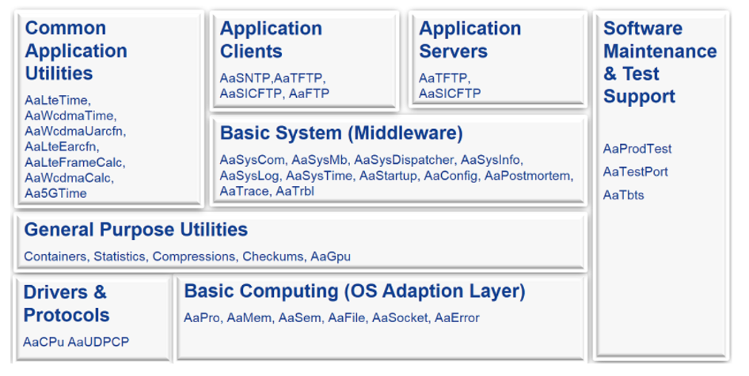

# RCP
Radio cloud platform(RCP), 提供common的服务与组件，比如CCS，Message，shared data layer，服务发现（lwsd），genapi等。APP基于这些组件及服务完成业务的开发。
RCP属于PASS层，提供PASS层的服务。

## CCS
CCS由CCSDaemon及ccslib组成。CCSDaemon主要负责创建Applications之间共享的资源，如syscom shared memory，启动并初始化通用的服务，如AaTrace server，Aatestport server，AaTrbl sever，资源清理，如Applications的退出时，shared memory的资源，启动并管理APP。
CCSLib提供APP进行集成，App通过调用不同服务的API，使用服务。
CCS大概提供20多个模块

### decomposition

Aasyscom，用于Applications之间的syscom通信
AasysMB，用于Applications之间的服务发现，即服务订阅
Aasyslog，Application用于打印日志
Aatrace，用于抓取特定的syscom消息
Aatrbl，以snapshot的方式，收集文件，启动日志等
Aaconfig，用于配置参数
AaFile，对系统IO操作的封装，同时，提供文件加解密的功能，基于FTP, TFTP and SICFTP protocols的远程文件访问
AaPro，对系统操作进程，线程资源的封装
AaShell，提供外部用户，通过shell与CCSDaemon进行交互
AaTestPort, 提供外部用户，通过TCP协议，获取内部的一些数据

### 复杂性
1. 维护的模块很多
2. 异常时，需要负责清理Application的资源

### 替代方案
与Aasyscom类似的，用于进程间通信的中间件，如ZeroMQ，gRPC，Kafka，Redis，RabbitMQ等，详见：
https://chat.openai.com/share/01565c02-82c8-491f-9781-780bee1a568e
与AasysMB类似的，用于服务发现的中间件，如Consul，etcd，ZooKeeper，Eureka等，详见：https://chat.openai.com/share/54881921-b246-499c-95f1-2b02297f9422
Aasyslog类似的产品，如syslog

## Compute
Compute domain提供并管理OS，RCP使用用的WanderOS是从Fedora Fork的。

## Database
RCP 使用redis作为database。

## Message
提供两种方案，一种是基于syscomgw的slow-path方案，支持non-multihoming SCTP，一种是`fastpath`方案，基于GTP-f over UDP

## Data Platform Middle(DPM)
DPM提供event machine的solution。有两个service，一个是DPM，另一个是EM-ODP。DPM基于DPDK，是DPDK的抽象。
### Decomposition
- event machine
- Timer
  基于event的，精准Timer，精度可以达到13us。

## Shared data layer
Shared data layer用于分布式APP之间数据交互。用于存储key-value pair data。

## Fault Management
提供Alarm功能

## LWSD
提供服务发现的服务，基于etcd实现

## Genapi
Genapi通过GenAPI，提供一些common的组件，比如controllable process，serviceProvider and serviceDiscover, genapiLog

## Security
Security包含如User 安全，存储安全，常见模块如CM（认证管理），UM（用户管理）。
针对不同的客户端， HTTP client, SSH client, NetAct，与之相对应的接口，Https， SSHv2及SOAP/Https。
### 三大原则
- Authentication
  身份认证，常见的手段，如：password
- Authorization
  操作授权，即仅允许被授权的操作
- Accounting
  计费，如audit log，所有的外部操作都被记录

## Log服务
包括Junurily Log
