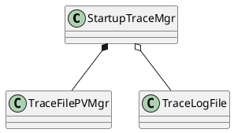
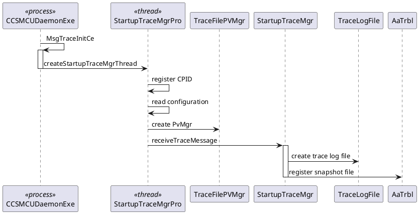

# startupTrace server

## Functionality
1. receive trace message from clients, then save to trace files.
2. register all trace files and message, which save in buffer, i.e haven't save to trace files, to snapshot, so all trace messages can be collected by snapshot. If container restart, register all not collected files, so those files can be collected in next snapshot.
3. overwrite the oldest trace file when no space left.
For the overview of SysCom trace log collection at start up, please refer to
https://nokia.sharepoint.com/:w:/r/sites/rcpdocuments/FDC/01______EFS%20extensions/CB009851-C%20Troubleshooting%20of%20vDU%20with%20RINLINE2/CB009851%20C%20vCU%20vDU%20SysCom%20trace%20log%20collection%20at%20startup%20RCP%20EFS%20extension.docx?d=w642b6bd4f93448efa71b70a3889aa742&csf=1&web=1&e=FjBcSv

## implementation
- class StartupTraceMgr
  class StartupTraceMgr is designed to receive trace message from client, then save to trace files.
  1. in general, save trace message to buffer. when buffer is full,then dump buffer to trace file on PV.
  2. if snapshot happened, then save trace buffer to trace file on `/tmp` directory.
  3. if signal TERM happened, then save trace buffer to trace file on PV
  4. the buffer size and trace file size can be configured.
  - note:
  1. currently, the timeout for receiving trace message is 1ms, so the startupTrace management can handle snapshot or signal TERM timely.
  2. trace log file is named with timestamp in milliseconds, it can prevent naming conflict and the `email` can order those trace log files and read all trace message in sequence. The last trace file named with `latest`, such as E010_startupSysComTrace-1679662927.atr and E010_startupSysComTrace-latest.atr
  3. when StartupTraceMgr is handling message, the following message will be buffered in syscom queue.

- class TraceFilePVMgr
  class TraceFilePVMgr is designed to manage trace files on PV.
  1. When PV is full, the TraceFilePVMgr will try to override the oldest trace logs files until have enough space to create a file.
  2. If PV has enough space to create a trace, then it can reserve it to create a file.
  3. file extension with '.tmp' means this can be override when space is not enough.
  4. file with extension '.atr' means file is locked by snapshot currently, which can't be deleted.

- class TraceLogFile
  class TraceLogFile is designed to use RAII to manage a trace log file. It will insert a file header before write trace log messages and rewrite message length into SSysComTraceFileHeader.msgLength before close file.
  the trace log file format, please refer to:
  https://nokia.sharepoint.com/:w:/r/sites/rcpdocuments/_layouts/15/Doc.aspx?sourcedoc=%7B642B6BD4-F934-48EF-A71B-70A3889AA742%7D&file=CB009851%20C%20vCU%20vDU%20SysCom%20trace%20log%20collection%20at%20startup%20RCP%20EFS%20extension.docx&action=default&mobileredirect=true.

## class diagram
StartupTraceMgr(size_t bufferSize, size_t fileSize, TraceFilePVMgr& pvMgr, const std::string& cbtsSwVersion);

## start up
start up the startup trace management

## Configuration
`ccs.service.aatrace.startuptrace.buffer.size`, default value is 32KB
`ccs.service.aatrace.startuptrace.tracelogfile.size`, default value is 256KB
`ccs.service.aatrace.startuptrace.persistentstorage.size`, default value is 64M

## receiver/startup trace server SIC address
the server cpid is AATRACE_LOG_COLLECTOR_CPID, for master NID, such as mgt 0xe010

## performance

## limitation
