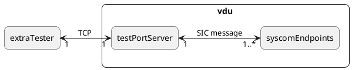
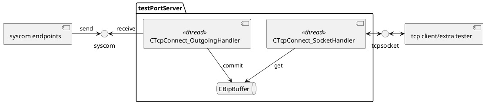
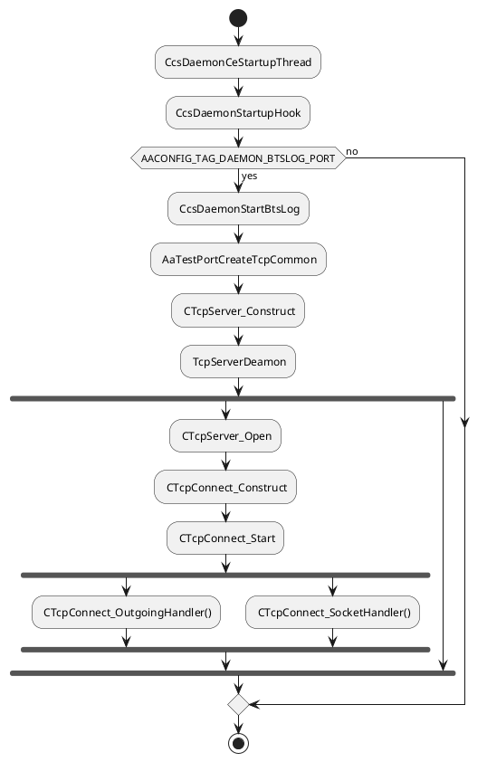

# testportserver

- [what's purpose](#whats-purpose)
- [main functions](#main-functions)
- [configure to start up testPortServer](#configure-to-start-up-testportserver)
- [`cpid` of syscom](#cpid-of-syscom)
- [AAShell command](#aashell-command)
- [performance](#performance)
- [difference between AaTestPortServer and AaTestPortClient](#difference-between-aatestportserver-and-aatestportclient)
- [implementation](#implementation)
- [reference](#reference)


## what's purpose
Exchange data between external tester and internal tbs module, exchange TCP message to SIC message.

### concept diagram

The testPortServer received SIC messages from multi syscom endpoints, such as mgt-container, then forward data to one tcp client.

## main functions
1. received SIC messages
The aaTestPortServer received SIC messages, then copy message to buffer.
2. forward SIC message to TestPort client through TCP
When the aaTestPortServer get data from buffer, then forward data to client. The send interval is controlled by select time out(`TCPCONNECT_FAST_POLL` or `TCPCONNECT_SLOW_POLL`) and the max send data size is controlled by `TCPCONNECT_MAX_SEND_SIZE`.

### component diagram

The thread `CTcpConnect_OutgoingHandler` received SIC message with block mode. If a message arrived, then commit to the CBitBUffer.
The thread `CTcpConnect_SocketHandler` loop get data from CBitBuffer with a interval time. If no data getting from buffer, then the sending interval will set to `TCPCONNECT_SLOW_POLL`, If not, then the sending interval will set to `TCPCONNECT_FAST_POLL`.
### startup diagram



## configure to start up testPortServer
```xml
<!--"the testPort server listened on any ip of client."-->
<tag name="ccs.daemon.startup.testport.server.securitymode" type="u32">0</tag>
<!--start up testPort server with `tbsport` mode and the port 15004-->
<tag name="ccs.daemon.startup.btslog" type="u32">15004</tag>
<!--configure the buffersize of 128000-->
<tag name="ccs.service.testport.buffersize" type="u32">128000</tag>
```
Note:
Currently, the max buffer size is 512000, which defined in `AATESTPORT_MAX_BUFFER_SIZE`.

## `cpid` of syscom
BTS_LOG_CPID 0x31d

## AAShell command
```bash
tp -s
```
## performance
[throughput](https://confluence.ext.net.nokia.com/pages/viewpage.action?spaceKey=RCP&title=AaTestPortServer)


## difference between AaTestPortServer and AaTestPortClient
The AaTestPortClient is single direction, which from Bts module to Outsider, but the AaTestPortServer is bi-direction.

## implementation
- CTcpServer_Open
```cpp
/** 1. create a socket
    2. bind to address
    3. listen on the socket
*/
static i32 CTcpServer_Open(CTcpServer* _this)
{
    // AF_INET6: support IPv6 and IPv4
    // SOCK_STREAM: byte stream
    // IPPROTO_TCP: TCP
    socket(AF_INET6, SOCK_STREAM, IPPROTO_TCP);
}

```

## reference
[Tester Communication Service User Scenarios](https://nokia.sharepoint.com/:w:/r/sites/ps/specification/SWTestability/_layouts/15/Doc.aspx?sourcedoc=%7BA5793B04-8DD5-49C1-801F-00732E68471D%7D&file=Tester%20Communication%20Service%20User%20Scenarios.docx&action=default&mobileredirect=true)
[AaTestPortServer specification](https://nokia.sharepoint.com/sites/ps/ccs/Shared%20Documents/Forms/AllItems.aspx?id=%2Fsites%2Fps%2Fccs%2FShared%20Documents%2Fautomation%20test%2FAaTestPortServer%2Epdf&parent=%2Fsites%2Fps%2Fccs%2FShared%20Documents%2Fautomation%20test)