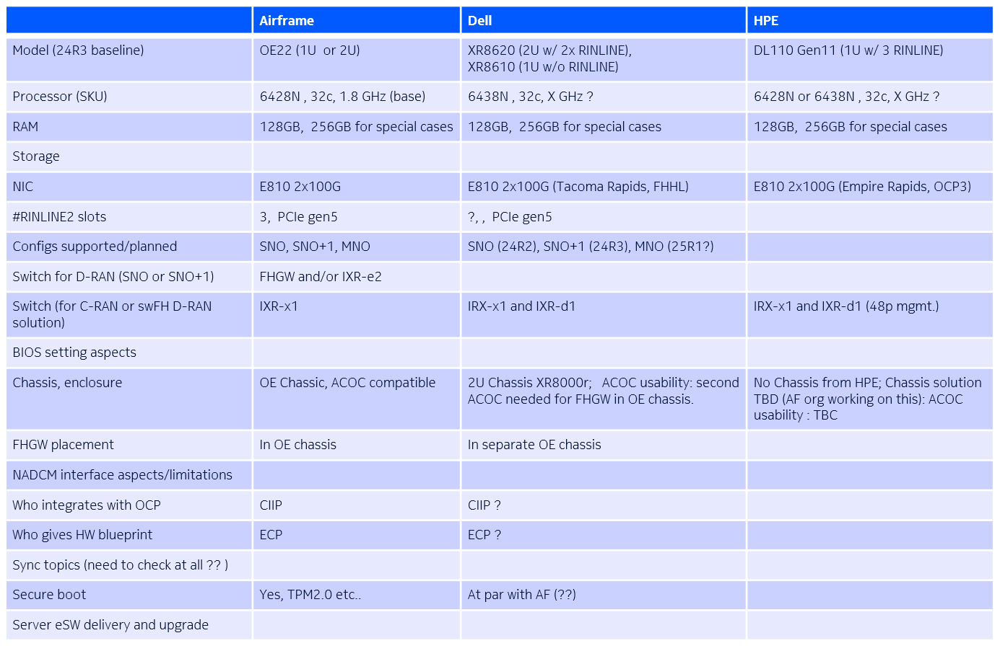

# vDU

- [hardware](#hardware)
- [architecture](#architecture)
  - [runtime environment](#runtime-environment)
- [resource](#resource)
  - [Single root IO virtualization（SR-IOV）](#single-root-io-virtualizationsr-iov)
  - [core allocate](#core-allocate)
- [deployment](#deployment)
- [network](#network)
  - [vCU network](#vcu-network)
- [build Image](#build-image)
- [build Application](#build-application)
  - [Application layer](#application-layer)

## hardware
Hardware solution

## architecture

### runtime environment

运行时环境，分成三层，
- OS层
  OS层包括OS，3rd party SW，driver, 在最底层。
- `Cass`层
  Cass层，在OS层之上，包括K8S，Helm，CNI，OCI(Docker)等
- Application层
  Applications在Cass层之上，Cass层是APP的运行环境。APP运行在Pod内的container中。

`Cloud`相比`bare metal`，多了一层`Cass`，因此，在构建时，需要构建成Image进行发布。

## resource
- CPU: 大约40个core
  UPUE Pods部署在dedicate core上，其他Pods，部署在shared/default core上。
- Memory：40GB
- NIC：2张100G的PCIe网卡，一个给k8s CNI使用，另一个给SR-IOV（VF）
- disk/PV: 大约30GB
- Pods
  差不多20多种Pods

### Single root IO virtualization（SR-IOV）
由PCIe实现，用于网卡与continaer（VM）之间，数据发送与接收的技术。有了这个技术，container的包，能够高效的发送到网卡，也能高效的从网卡收数据。通过SR-IOV，单个PCIe 口虚拟出很多VF（虚拟的口），NIC与container之间，通过VF，快速的交互数据。
详见：https://www.google.com/search?q=sr-iov+networking&rlz=1C1GCEA_enFI955FI955&oq=SR-IOV+net&gs_lcrp=EgZjaHJvbWUqBwgAEAAYgAQyBwgAEAAYgAQyBggBEEUYOTIHCAIQABiABDIHCAMQABiABDIHCAQQABiABDIICAUQABgWGB4yCAgGEAAYFhgeMggIBxAAGBYYHjIICAgQABgWGB4yCAgJEAAYFhgeqAIIsAIB&sourceid=chrome&ie=UTF-8#fpstate=ive&vld=cid:accb749d,vid:hRHsk8Nycdg,st:0

### core allocate

## deployment

## network
NIC configuration

### vCU network

## build Image
Cloud上的Application，需要以Docker Image或者Container的方式，进行发布。
利用Docker工具，构建需要Docker Image。

## build Application
Cloud上Application结构与Legacy的一样，所以，构建Application没有不一样。

### Application layer

Application可以分成三层：
- OS层
  OS层，是最底层，包括OS，3rd party SW，driver
- RCP层
  RCP层，在OS层之上，包括一些common的组件，如message，ccs等，其与业务无关。
- 业务层
  业务层基于RCP层，实现具体的业务。
详见：[RCP](./rcp.md)
