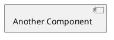

# cb009875

## Table of contents

## requirements
1. when the adet service receive syscom message of the RANNIC static data from l1pf, then publish these data to OAM BB
2. the syscom message ID is API_AUTODET_L1_READY_IND_MSG and the static data contained in payload
3. the attributes published to OAM are
    attr_productCode
    attr_serialNumber
    attr_nokiaPartNumber
    attr_activeSwVersion
    attr_hwVersion
    attr_productName

### ref CFAM doc

### note:

## user case
1. adet receive syscom data form l1pf
2. adet publish RANNIC static data to OAMBB

## design
As the message ID reuse the previous, so there are some derived requirement and design, such as
1. the adet receive multi message among 1.2 seconds sent form l1pf, then the adet will only publish the last data.
2. only both AdetStatusProvider and AdetL1L2Provider are ready, then the attributes will be published.

## service diagram

package adet {
    rectangle RANNICHWINfo
    rectangle FiveGService
    rectangle L1L2Mapping
}

