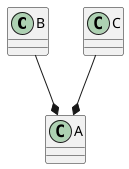
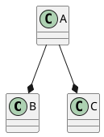

# SOLID principles

- [what](#what)
- [SRP](#srp)
  - [评判标准](#评判标准)
  - [耦合度评估](#耦合度评估)
    - [减少耦合度的技巧](#减少耦合度的技巧)
  - [为什么](#为什么)
  - [SRP由来](#srp由来)
  - [code smell](#code-smell)
- [OCP](#ocp)
  - [scenario](#scenario)
- [LSP](#lsp)
  - [LSP violation(code smell)](#lsp-violationcode-smell)
  - [how to fix](#how-to-fix)
- [interface aggregation](#interface-aggregation)
- [DIP, dependency injection principle](#dip-dependency-injection-principle)
- [reference](#reference)

## what
S: single responsibility principle,(SRP)
O: open-close principle (OCP)
L: LSP
I: interface segregation principle
D: dependence inverse principle

## SRP
SRP定义比较模糊。实践中，可操作的评判标准是：模块是否高内聚，低耦合，最大化的隐藏（最小化暴露）。

### 评判标准
1. 模块是高内聚，低耦合
   - 内聚：即单个模块内，功能之间的相关程度
   - 耦合：是抽象的概念，指模块之间的相互依赖。直观的看，就是一个模块，修改代码后，对其他模块的影响。
   - 模块：即一个有边界的，包含很多操作的，命名的单元，即一个有名字的代码块。通常可以是一个class，一个namespace，一个文件
    如果代码改动，只在一个地方，只在一个模块内部，不影响其他模块，说明该模块是高内聚，低耦合的，那么该模块符合SRP原则。
2. 模块是最小化暴露

### 耦合度评估
耦合度，可以通过如下的指标进行评估，
1. Coupling between object(CBO):
   即一个对象依赖，多少个其他对象。依赖数越多，耦合越大
2. Afferent Coupling(CA)
   即依赖该对象的，其他对象的个数。对象越多，耦合越大。
   如：对象B及对象C以聚合的方式使用对象A，CA = 2;

3. Efferent Coupling(CE)
   即该对象，依赖其他对象的数量。对象越多，耦合越大。
   如：A对象以聚合的方式使用对象B,C，CE = 2;

4. Instability
   Instability即被评估对象，因为其他对象改变，而变化。I = CE/(CE+CA)。I越接近1，说明耦合越大，I接近于0，说明为单独模块，没有依赖。
5. Cyclomatic complexity(CO):
   Code block中分支的数量，包含的分支越多，CO越大。如`if`，`for`，`break`,`loop`等关键字
   CO用来间接的评估代码耦合度。
6. Depth of Inheritance Tree
   即继承的层数。用来间接体验耦合读。

#### 减少耦合度的技巧
1. 依赖注入, `dependency injection`
2. 设计模式，如工厂模式，观察者模式，策略模式
3. 减少分支的使用，如使用设计模式
Cyclomatic complexity，详见:https://www.omnicalculator.com/math/cyclomatic-complexity

详见：https://chat.openai.com/share/21e28613-3a3e-4496-99b7-df975417598c

### 为什么
1. 代码容易维护，每次修改，只需要在一个地方
2. 命名精确，用户容易使用

### SRP由来
`module`是`decomposition`过程中自然形成的。当`decomposition`及`recomposition`过程中，**考虑模块的内聚，耦合及最小化暴露问题时**，才有了SRP的原则。

- `decomposition`
  `decomposition`即问题拆解。在解决现实问题时，我们自然而然地通过问题拆解，将大问题拆分成小问题，通过解决小问题，来解决大问题。

### code smell
1. `change`在多个地方，而不是在一个地方。
2. `change`影响到其他模块，而不是只影响到模块内部。

详见：https://thevaluable.dev/single-responsibility-principle-revisited/
https://dev.to/tamerlang/understanding-solid-principles-single-responsibility-principle-523j

## OCP

### scenario
type-based programming.
add a new type.

## LSP
A subclass should substitute a superClass without breaking any client functionality.

### LSP violation(code smell)
1. client need to identify the actual subclass, such as `getInstanceName` or `getInstanceType`
2. subclass throw an exception but supper class not.
3. Empty implementation of one or more functions in subclass.

### how to fix
move the violation interface from superClass.

## interface aggregation

## DIP, dependency injection principle

## reference
[solid](https://dev.to/tamerlang/understanding-solid-principles-liskov-substitution-principle-46an)
[solid video](https://www.youtube.com/watch?v=Ntraj80qN2k)
