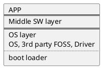

# architect pattern

## micro-kernel/微内核
产品设计与架构基于核心系统与插件的方式，如vscode。**一种非常适合聚焦于产品/APP的架构**。
该设计也能嵌入到其他设计中，比如分层设计的一部分，使用微内核架构。
核心系统定义通用的业务逻辑，插件系统实现具体的业务逻辑
设计时聚焦于：
1. 插件如何注册，插件的粒度及插件的链接方式
2. 规约的版本控制。啥意思？
3. 定义通用的业务逻辑
4. 插件与核心的通信规范
- note
  `DIP`与微内核架构，是高可扩展设计的一体两面，一个面向产品，一个面向设计。

## 分层设计(layered architecture)
即把软件系统按功能分层。由上到下，通常包含展示层，业务层，持久层与数据库层
- 目的
  实现业务隔离
- 适用场景
  适用于大型的软件系统，比较High level的描述与功能划分。
- pros and cons
  pros： 业务隔离，功能职责分开，其中一层的改变不影响其他层。
  cons： 任何业务的处理，都会贯穿所有层次，响应比较慢，耦合性比较高

例子：
APP，应用功能SW，业务功能
middle SW layer，一些通用的模块/component，HW agnostic 软件
OS layer, 包括boot loader，OS，3rd party FOSS and Driver。

## 事件驱动
事件驱动设计基于异步编程，通常包含`event initiator`, `event channel`及`event processing`.

- 适用场景
  1. 业务处理天然是基于某事发生，即响应事件，而不是响应用户请求。
  2. 复杂不需要确定性的控制流的应用
- 不适用场景
  1. 需要控制事件的处理流，事件之间有顺序关系
  2. 事件需要严格timing，如要求事件在某个时刻处理
- pros
  高性能，低耦合，方便扩展extensibility及scalability，高容错性
- cons
  编程难度较高，调试及测试比较困难

## microservice
microservice演化于对单体应用持续交付及简化基于服务架构的需求。即将原来的一整个巨星APP或者巨型服务器，切分成一个个功能模块提供功能及服务。
- Features
  1. 有清晰的边界，data数据与server被组织在一起，即通常data只被本服务适用，不被其他服务使用
  2. 单独`deployment`
- 适用场景
  1. 对Scalability，容错性（fault tolerance）要求很高, 即elastic systems
- 不适用场景
  1. 不同microservice使用的数据是密切耦合在一起的，导致microservice之间的交互频繁。服务之间的network, security(authority), data latency就会导致系统性能的下降。

## reference
1. https://learning.oreilly.com/library/view/software-architecture-patterns/9781098134280/ch06.html#idm46088525023840
2. https://raw.githubusercontent.com/bboyfeiyu/android-tech-frontier/master/software-architecture-patterns/%E8%BD%AF%E4%BB%B6%E6%9E%B6%E6%9E%84%E6%A8%A1%E5%BC%8F.pdf
