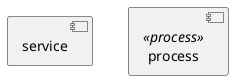
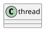
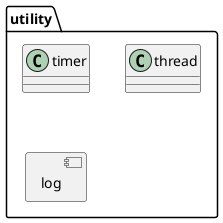

# uml

## component
component 对应于大型软件系统中的subsystem，component 是high-level的一种表示
component provides a set of interfaces and functionality.
component 通常由一系列的class组成，这些class都是密切相关的。
component 应该是reuseable, high cohesion, and strong encapsulation.
component 聚焦在接口与功能上

举例：
service 可以用component表示
process 是具体的实现，可以加衍性来修饰

## class
object的抽象，是OOP最基本的单元

## package
package 用来把uml元素组织到一起，表示一个范围，是namespace的概念

## Reference
[uml2.0 in a nutshell](./UML2InANutshell.pdf)
