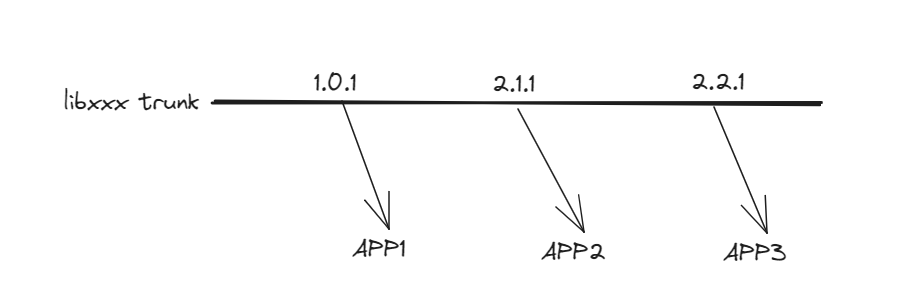
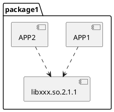
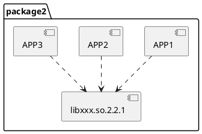
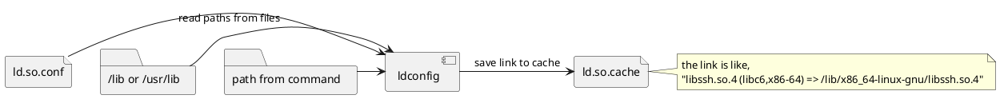

# shared library management

## APP(ELF)对象管理shared library
通过编译器，ELF对象管理所有依赖的动态库。

编译时，ELF对象，在`.dynamic`区中，记录所有依赖的动态库的SO_NAME，即库名字及主版本号，如：`libxxx.so.x`。如通过GCC -lxxx, 编译器会自动选择，当前编译环境上`xxx`最新版本，然后，将`libxxx.so.x`记录到ELF里面。

ELF在启动的同时，启动动态连接器，如：linux 环境下的`ld-linux.so.x`。动态连接器，根据`.dynamic`记录的路径信息，搜索运行环境上的动态库是否存在且满足要求。比如`libxxx.so.2`，则要求存在对应的动态库`libxxx.so.2.x.x`。若不存在或者低于该版本，则程序执行时，通常会报错。

## shared library的开发者
动态库开发者，根据ABI语义（规则），负责管理动态库版本，即通过ABI规则，修改动态库版本,详见：[ABI.md](./ABI.md)。
`CI`工具或者APP开发者，根据shared library版本号规则，识别是否需要重新编译APP。

## 产品(package)版本管理或者发布
通常Package，记录着所有APPs及包含版本的模块。当选定一个包后，所包含的模块版本就已经确定了。以模块libxxx.so及其上的APPs为例。假设`APP1`基于`libxxx.so.1.0.1`开发，`APP2`基于`libxxx.so.2.1.1`，`APP3`基于`libxxx.so.2.2.1`开发。

`Package 1`: 包含`APP1`,`APP2`,`libxxx.so.2.1.1`。因为`APP1`与`libxxx.so.2.1.1`不兼容，所以，`Package 1`中的`APP1`，需要基于`libxxx.so.2.1.1`重新编译，这样`Package 1`才能正常工作。
- note
  1. 重新编译，通常由`CI`完成。
  2. 编译环境与运行环境，版本总是对齐的

`Package 2`: 包含`APP1`,`APP2`,`APP3`,`libxxx.so.2.2.1`。根据ABI规则,`APP1`需要重编，`APP2`不需要。

<figure>
  
  <figcaption>Figure1: APPs development on `xxx` component</figcaption>
</figure>

重编后，无论`package1`还是`package2`，只包含最新版本的libxxx.so.2.1.1

## 动态库检索
动态连接器,优先在`ld.so.cache`中搜索，然后，在配置文件`ld.so.conf`中记录的路径上，进行搜索。

- 任何动态库地安装，删除，安装工具一般会通过工具`ldconfig`来更新`ld.so.cache`。
`ldconfig`在指定路径下搜索库文件，即`/lib(/lib64)` or `/usr/lib`，`ld.so.conf`文件中的路径及命令行指定的路径，然后，建立`soname`到绝对路径的对应关系，并存储到`ld.so.cache`
注：若不用`.conf`文件指定路径，RPM工具可以不用显示的调用`ldconfig`，详见：https://fedoraproject.org/wiki/Changes/Removing_ldconfig_scriptlets

- `RPATH` or `RUNPATH`
  `RPATH`是ELF的`.dynamic`区上的一个字段，用来指示动态库的检索路径，一个hard code的路径。当存在这个字段时，ELF启动时（on runtime），优先在这个路径下进行检索，即检索顺序变化为：
  (a) DT_RPATH -> (b) LD_LIBRARY_PATH -> (c) DT_RUNPATH -> (d) cache (/etc/ld.so.cache) -> (e) system defaults
  `RPATH`一般通过`-R`或者`-rpath`的链接标志，在编译时，添加到ELF中。

  因为`RPATH`会引起检索路径变化，存在安全风险，所以，在production产品中，不会推荐使用。如fedora的rpm工具就会默认检查`broken rpath`。 如何存在`broken rpath`，则rpmbuild就会失败。
  详见：https://fedoraproject.org/wiki/Changes/Broken_RPATH_will_fail_rpmbuild
  https://en.wikipedia.org/wiki/Rpath
